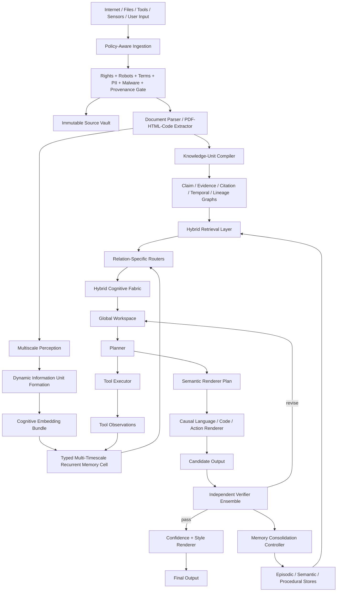

# NUERONCE Hybrid Foundational Model — Implementation Map and Pseudocode

> This document is the design source of truth for the `nueronce` package. It is the
> implementation map supplied for the project. The code under `nueronce/` implements
> the fully-specified, backend-light parts of this design and exposes typed
> interfaces (raising `BackendNotConfigured`) for the learned neural components.
> See `docs/architecture.md` for the mapping from these sections to modules.

## Executive summary

The NUERONCE proposal is not a request for "a better Transformer." It is a request
for a different *division of labor*: perception should not be the same subsystem
as planning, planning should not be the same subsystem as surface realization,
retrieval should not be conflated with parametric memory, and generation should
not certify its own correctness. The thesis replaces
`next_token = MODEL(previous_tokens)` with a pipeline closer to
*perceive → represent meaning → determine intent → retrieve evidence → reason →
plan → communicate → verify → revise*.

The architecture is **hybrid** rather than single-mechanism:

- Local pattern extraction → byte/character CNN-style perception + dynamic patching.
- Temporal continuity → a typed multi-timescale recurrent state.
- Exact nonlocal comparison → sparse/local attention and retrieval.
- Belief and contradiction → explicit evidence channels.
- Planning → a latent workspace.
- Language realization → a constrained renderer.
- Truthfulness → a verifier that is *not* just another pass through the generator.

Open primary-source precedents: Transformers (content-addressed attention); GPT-3
(autoregressive scaling); BERT (bidirectional representations); ViT (patch
sequences); RETRO / InstructRetro (retrieval augmentation); Mamba, RWKV, Hyena
(linear-time recurrent / selective-state / long-convolution operators).

## Design principles

1. **Functional separation** — separate understanding, thinking, remembering, and
   speaking instead of forcing one decoder-only network to do all four via token
   continuation.
2. **Typed state, not one homogeneous hidden vector** — separate semantic,
   structural, goal, evidence, uncertainty, authority, memory, and temporal
   channels. A single cosine space cannot safely encode semantic similarity,
   exact lexical identity, provenance, temporal validity, contradiction, and
   authority as if they were one relation.
3. **Operator specialization instead of "attention everywhere"** — local
   processing, recurrent/continuous state, sparse global comparison, retrieval,
   symbolic constraints, and planning/search each get the right operator.
4. **Evidence, provenance, and authority are first-class** — every memory/evidence
   item carries source, authority level, timestamps, contradiction links,
   confidence, and review status; external/retrieved content is data unless
   authorized as instruction.

### Operator division of labor

| Function | CNN / local conv | Attention | Recurrence / SSM |
|---|---|---|---|
| Local pattern extraction | Strong, efficient | Possible but expensive | Weak without extra structure |
| Long-range lookup | Weak unless deep/dilated | Strong | Compressed, indirect |
| Streaming inference | Good | KV-cache grows with length | Excellent |
| Exact distant recall | Poor | Strong | Poor unless retrieved |
| Continuous latent state | No | Weak | Native |
| Best NUERONCE role | Perception / boundary finding | Relation routing / sparse comparison | Typed persistent state |

### Retrieval representation split

| Representation | Strength | Weakness | NUERONCE use |
|---|---|---|---|
| Dense single-vector | Fast broad semantic recall | Loses exact identifiers | Initial recall |
| Sparse lexical | Excellent exact match | Weak paraphrase | Exact names, code, citations |
| Multi-vector late interaction | Preserves local matching | Heavier storage/inference | Reranking / evidence alignment |

## Assumptions and NUERONCE-350M defaults

These are *implementation defaults for a minimal reproducible prototype*, not
values fixed by the source notes. They live in `nueronce/config.py`.

| Parameter | Default | Status |
|---|---:|---|
| Input units | Raw UTF-8 bytes + optional modality adapters | Supported by notes |
| Byte/char encoder width | 512 | Assumption |
| Shared core width `d_model` | 1536 | Assumption |
| Recurrent memory channel width per type | 256 | Assumption |
| Workspace slots | 32 | Assumption |
| Physical backbone blocks | 6 reused blocks | Assumption |
| Logical recurrent steps | 12–24 by mode | Assumption |
| Local attention window | 256–512 dynamic units | Assumption |
| Sparse global routing budget | Top-64 units per step | Assumption |
| Dense retriever dim | 768 | Assumption |
| Sparse lexical vocab | hashed 2^20 features or learned sparse terms | Assumption |
| Quantization target | 8-bit base, 16-bit activations | Assumption |
| Prototype parameter budget | ~350M | Requested target |

## System architecture



The left side is provenance-preserving ingestion and dynamic information units;
the middle is the typed hybrid core; the right side is planning, tool use,
verification, and controlled consolidation.

## Runtime data structures

Implemented in `nueronce/types.py`: `SourceRecord`, `KnowledgeUnit`,
`CognitiveEmbeddingBundle`, `MemoryRecord`, `TaskState`, `WorkspaceSlot`,
`VerificationFailure`, `VerificationReport`, plus the controlled vocabularies
(`AuthorityLevel`, `MemoryType`, `UnitType`, `RelationType`) and the typed
channel list `CHANNELS`.

JSON schemas and worked examples for the wire records live in `nueronce/schemas/`.

## Subsystem notes

### Ingestion + provenance gate (`nueronce/ingestion.py`)
A policy engine distinguishes what may be crawled, stored, indexed, used for
retrieval, or used for weight training. `PolicyGate` blocks on robots, terms,
license, and PII risk; `IngestionCrawler` builds content-addressed `SourceRecord`s.

### Parser + knowledge-unit compiler (`nueronce/parsing.py`)
Raw HTML/PDF/code is converted into structured content units rather than flat
text, then compiled into `KnowledgeUnit`s with claims, evidence refs, equations,
code, temporal scope, and provenance links.

### Multiscale perception + dynamic patching (`nueronce/perception.py`)
Fixed tokenization is replaced with dynamic information units derived from raw
bytes, local predictability, entropy, semantic shift, and syntax boundaries
(cf. the Byte Latent Transformer). `dynamic_patching` combines a learned boundary
logit, a semantic-shift estimate, and a syntax spike.

### Cognitive embedding bundle (`nueronce/embeddings.py`)
One unit maps to semantic, lexical, structural, hierarchical, temporal,
provenance, belief, and authority representations.

### Typed recurrent memory (`nueronce/memory.py`)
Per channel k ∈ {sem, str, goal, evid, unc, auth, proc}:

```
f_t^k = σ(F_k([x_t, h_{t-1}, g_t, u_t]))
w_t^k = σ(W_k([x_t, h_{t-1}, m_t, e_t]))
r_t^k = σ(R_k([x_t, c_t^k, g_t]))
Δc_t^k = T_k([x_t, h_{t-1}, m_t, e_t])
c_t^k = λ_k ⊙ f_t^k ⊙ c_{t-1}^k + a_t^k ⊙ w_t^k ⊙ Δc_t^k
h_t^k = r_t^k ⊙ φ_k(c_t^k)
```

with `a_t^k` an authority permission mask and `λ_k` a retention timescale.
Consolidation is *evidence-gated*, not automatic (scoring is implemented).

### Relation routers (`nueronce/routers.py`)
Semantic / lexical / structural / temporal / authority relations get distinct
scoring functions instead of one attention score.

### Hybrid retrieval (`nueronce/retrieval.py`)
Dense ANN + sparse inverted index + late-interaction rerank, fused with
provenance, temporal, and contradiction terms.

### Hybrid cognitive fabric (`nueronce/core.py`)
`HybridBlock` merges SSM, local attention, sparse global attention, and retrieval
injection via a softmax router; `NUERONCECore` reuses a few physical blocks over
mode-dependent logical depth (FAST/DELIBERATE/RESEARCH).

### Workspace, planner, renderer, verifier (`nueronce/workspace.py`, `nueronce/planning.py`, `nueronce/verification.py`)
A latent workspace with typed slots; a planner that fixes *what to say* (evidence
map, uncertainty map, caveats, discourse order, prohibited unsupported claims); a
two-stage renderer; and an independent verifier ensemble driving a
verify→revise loop.

### Tools + authority (`nueronce/tools.py`)
Tool outputs are authoritative observations that update state; execution is gated
by an explicit authority context.

### Compact runtime (`nueronce/runtime.py`)
Shared recurrent blocks, LoRA adapters, and SSD/RAM-backed memory keep the
350M prototype within a low-VRAM budget.

## Training

### WPGCP — Web-Scale Provenance-Grounded Curriculum Pretraining
Multi-objective, multi-phase curriculum (perception → bidirectional
reconstruction → retrieval/provenance/evidence → world/tool/planning → mixed
steady state). Loss family:

```
L = λ_lang L_lang + λ_byte L_byte + λ_sem L_sem + λ_ent L_entail
  + λ_contra L_contra + λ_retr L_retr + λ_ground L_ground + λ_world L_world
  + λ_temp L_temp + λ_route L_route + λ_mem L_mem + λ_plan L_plan
  + λ_cal L_cal + λ_rev L_rev
```

Implemented: phase scheduler, phase-dependent weights, episode dispatch, loss
aggregation/registry (`nueronce/training/curriculum.py`, `episodes.py`, `losses.py`).

### VGRFT — Verifier-Guided Residual Fine-Tuning
Structured instruction tuning → tool-grounded tuning → verifier training →
residual correction experts, plus controlled continual learning (index first →
episodic staging → scheduled adapter updates with regression gating and rollback).
See `nueronce/training/vgrft.py`.

## Evaluation surface

| Category | Metric | Test design |
|---|---|---|
| Language modeling | bits-per-byte / perplexity | held-out books, papers, code |
| Dynamic patching | compression ratio vs accuracy | fixed tokens vs dynamic units |
| Delayed recall | exact recall after distractors | inject at step 1, query at 100/1000 |
| Contradiction handling | support/contradict F1 | paired opposing-polarity claims |
| Citation grounding | precision/recall, unsupported-claim rate | claim-level evidence audit |
| Calibration | ECE / Brier / false-certainty | answerability-annotated QA |
| Routing correctness | top-k route accuracy | vs oracle traces |
| Tool trajectories | success / false-success rate | repos, tests, schema checks |
| Memory consolidation | stale-write / overwrite-error rate | evolving facts, versioned APIs |
| Compute efficiency | GPU-seconds per solved task | across modes and ablations |

## Research hypotheses (falsifiable)

| ID | Hypothesis | Comparison |
|---|---|---|
| H1 | Dynamic byte patches cut compute while preserving exactness | BLT-style vs fixed tokenizer |
| H2 | Typed recurrent state improves long-trajectory stability | typed cell vs decoder-only vs RWKV/Mamba |
| H3 | Dense+sparse+late retrieval improves citation precision | dense-only vs hybrid |
| H4 | Planner-before-renderer improves completeness | direct vs planned generation |
| H5 | Independent verification reduces unsupported-claim rate | with vs without verifier |
| H6 | Authority masks reduce prompt-injection failures | with vs without authority gate |
| H7 | Multi-objective WPGCP improves grounding/calibration at equal compute | mixed vs causal-only |
| H8 | Residual correction experts beat repeated full fine-tunes | experts vs monolithic FT |

## Prototype budget (NUERONCE-350M)

| Component | Working target |
|---|---:|
| Byte/char perception | ~20M |
| Dynamic patcher / boundary modules | ~5M |
| Shared hybrid core | ~280M |
| Heads + planners + verifier adapters | ~35M |
| Embeddings / output | ~10M |
| **Total** | **~350M** |

## Prioritized bibliography

- Transformers: *Attention Is All You Need*.
- Autoregressive scaling: *Language Models are Few-Shot Learners* (GPT-3).
- Bidirectional pretraining: *BERT*.
- Patch sequences: *An Image is Worth 16x16 Words* (ViT).
- Retrieval augmentation: *RETRO*; *InstructRetro*.
- Embeddings/retrieval: *Sentence-BERT*, *SimCSE*, *ColBERTv2*, *SPLADE*, *CLIP*,
  *VQ-VAE*, *Poincaré Embeddings*, *FastText*.
- Dynamic byte patching: *Byte Latent Transformer*.
- Sequence alternatives: *Mamba*, *RWKV*, *Hyena Hierarchy*,
  *Learning Longer Memory in RNNs*, *LSTM: A Search Space Odyssey*.
- Training/alignment: *UL2*, *DoReMi*, *LoRA*, *Let's Verify Step by Step*,
  *Direct Preference Optimization*.
